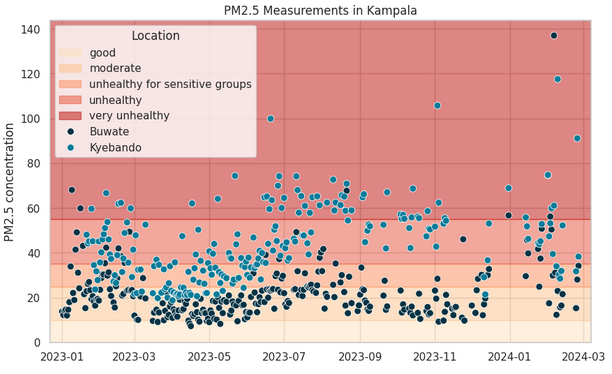
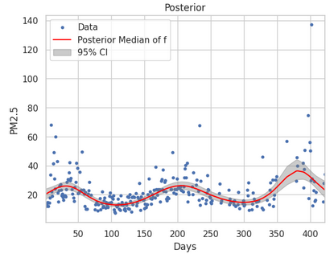

# PM2.5 Air Pollution Modeling in Kampala using Gaussian Processes

This project analyzes air pollution data from Kampala, Uganda, focusing on PM2.5 (fine particulate matter) concentrations. A Gaussian Process (GP) model with a Hilbert Space approximation (HSGP) is implemented using Stan (via CmdStanPy) to predict PM2.5 levels and estimate the number of days per year exceeding unhealthy thresholds as defined by WHO guidelines.

## Objective

The primary goal is to:
1.  Implement a GP model to predict daily average PM2.5 concentrations for a selected site in Kampala.
2.  Estimate the number of days in a full year where PM2.5 concentrations are unhealthy (above 35 µg/m³).
3.  Visualize model outputs and diagnostics.

## Data

The data consists of satellite-derived PM2.5 measurements and other atmospheric variables for eight cities in seven African countries. This project focuses on data for Kampala. The dataset is sourced from the [MLGlobalHealth/StatML4PopHealth repository](https://github.com/MLGlobalHealth/StatML4PopHealth/blob/main/data/sentinel_5p_particulate_matter.csv).

**WHO PM2.5 Health Risk Classification:**
The WHO provides guidelines for PM2.5 levels:
- **Good:** 0-10 µg/m³
- **Moderate:** 10-25 µg/m³
- **Unhealthy for Sensitive Groups:** 25-35 µg/m³
- **Unhealthy:** 35-55 µg/m³
- **Very Unhealthy:** >55 µg/m³

## Methodology

### 1. Site Selection & Preprocessing
- Data for Kampala is extracted.
- A specific measurement site, "Buwate" (originally `site-4`), is selected for detailed modeling.
- The date is converted into a numerical feature (days since the first observation) and standardized for model stability.

### 2. Gaussian Process Model (HSGP)
A Log-Normal observation model is used for PM2.5 concentrations:
- \(y_i \sim \text{LogNormal}(\mu_i, \sigma^2)\)
Where \(y_i\) is the PM2.5 concentration at observation \(i\).
The mean parameter \(\mu_i\) is modeled as:
- \(\mu_i = \beta_0 + f(\text{date}_i)\)
- \(\beta_0 \sim \text{Normal}(0, 2)\) is the intercept.
- \(f \sim \text{GP}(0, k)\) is a Gaussian Process capturing non-parametric time effects. A squared exponential kernel is approximated using a Hilbert Space basis function expansion (HSGP).
- Priors for GP hyperparameters (marginal standard deviation \(\alpha\), lengthscale \(\rho\)) and observation noise \(\sigma\) are specified as:
    - \(\alpha \sim \text{Half-Cauchy}(0, 1)\)
    - \(\rho \sim \text{Inverse-Gamma}(5, 1)\)
    - \(\sigma \sim \text{Half-Cauchy}(0, 1)\)

The model is implemented in Stan and fitted using CmdStanPy.

## Repository Structure

```
pm25-hsgp-kampala/
├── .gitignore
├── README.md
├── requirements.txt
├── stan_models/
│   └── hsgp_se_model.stan  # Stan model code
├── src/
│   ├── main.py             # Main Python script for analysis
│   └── utilities.py        # Utility functions (e.g., for CmdStan installation)
└── plots/                  # Generated plots
    ├── kampala_sites_map.html
    ├── pm25_buwate_kyebando_eda.png
    ├── model_trace_plots.png
    └── posterior_pm25_buwate.png
```

## How to Run

1.  **Clone the repository:**
    ```bash
    git clone <repository-url>
    cd pm25-hsgp-kampala
    ```

2.  **Set up a Python virtual environment (recommended):**
    ```bash
    python -m venv venv
    source venv/bin/activate  # On Windows: venv\Scripts\activate
    ```

3.  **Install dependencies:**
    ```bash
    pip install -r requirements.txt
    ```

4.  **Install CmdStan:**
    The `src/main.py` script attempts to download `utilities.py` (if not present) and run `custom_install_cmdstan()` to install CmdStan. This is primarily for Colab-like environments.
    Alternatively, ensure CmdStan is installed manually and the `CMDSTAN` environment variable is set to its path. You can download CmdStan from [here](https://mc-stan.org/users/interfaces/cmdstan).
    Example manual installation:
    ```bash
    # Download and extract CmdStan
    # cd to cmdstan directory
    # make build
    # export CMDSTAN=<path_to_cmdstan_directory>
    ```

5.  **Run the analysis script:**
    ```bash
    cd src
    python main.py
    ```
    Plots and results will be saved in the `plots/` directory and printed to the console.

## Results

### Exploratory Data Analysis

**Kampala Measurement Sites:**
(The interactive map `kampala_sites_map.html` is generated in `plots/`)

**PM2.5 Time Series for Selected Sites (Buwate & Kyebando):**

*This plot shows the raw PM2.5 measurements for two sites in Kampala, overlaid with WHO air quality guideline bands.*

### Model Diagnostics (for Buwate site)

**Trace Plots:**

*Trace plots for key model parameters (\(\beta_0\), \(\alpha\), \(\rho\), \(\sigma\)). These help assess MCMC convergence and mixing. Some divergences were noted, indicating potential areas for model refinement.*

### Posterior Predictions (for Buwate site)

**PM2.5 Posterior Prediction:**

*This plot shows the observed PM2.5 data points, the posterior median prediction from the GP model, and the 95% credible interval.*

### Main Objective: Unhealthy Days
For the "Buwate" site:
- Based on the posterior median predictions for the *observed data points*, an estimated **X** days (from script output) had PM2.5 concentrations above 35 µg/m³.
- Extrapolating this, approximately **Y** days (from script output) in a full year might experience unhealthy PM2.5 levels at this site.

*(Note: X and Y will be filled by running `main.py`)*

## Discussion & Conclusion

The HSGP model provides a flexible way to capture the temporal dynamics of PM2.5 concentrations. The analysis for the "Buwate" site in Kampala suggests a non-negligible number of days with unhealthy air quality, posing a potential public health risk.

**Limitations & Future Work:**
- The MCMC sampling exhibited some divergences, suggesting that the model could be improved, possibly through reparameterization, different kernel choices (e.g., Matérn), or more informative priors for certain parameters.
- The estimation of unhealthy days for a full year was based on extrapolating from observed data points. A more robust approach would involve modifying the Stan model's `generated quantities` block to make predictions for all days in a year, including those without observations.
- Spatial effects between sites were not modeled. A spatio-temporal GP could provide a more comprehensive understanding.
- Analysis could be extended to other sites in Kampala or other cities.

## Authors (from OCR)
- Ando Harilala Daniel Rakotondrasoa
- Lahatra Fitiavana Harinasandratra
- Maharavo Rakotonirainy
- Onintsoa Anjara Rakotondranisa
- Toky Iriana Rajaofera
- Hlonipha Sikota (external) `hloniphalisa@gmail.com`
- Bester Saruchera (external) `Sarucherab@ukzn.ac.za`
*(This project appears to be based on their work/instructions.)*
